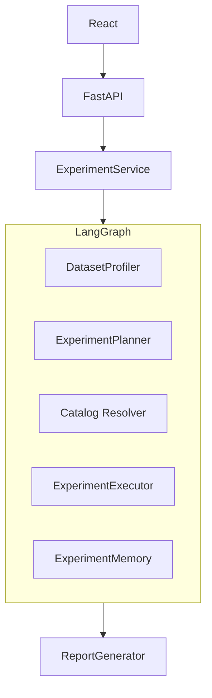
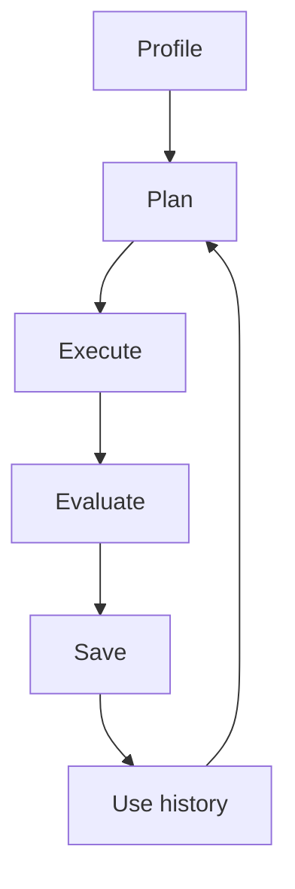

# Agentic ML Experimentation System

## Problem Statement
Traditional experimentation often requires manually selecting models, running experiments, comparing results, and deciding what to try next. This iterative process is time-consuming and relies heavily on human intuition and manual tracking.

## Solution
This system uses a Large Language Model (LLM) as an autonomous experiment planner, automating the decision-making process while keeping the actual Machine Learning execution deterministic and controlled. It bridges the reasoning capability of LLMs with the statistical rigor of traditional ML libraries.

## Core Idea
The responsibilities of the system are strictly separated:
- **LLM** = planning/reasoning
- **Scikit-learn** = execution
- **LangGraph** = orchestration
- **SQLite** = experiment memory
- **Pydantic** = structured contracts
- **FastAPI** = API
- **React** = UI

## Architecture


## Agent Loop


## Controlled Search Space
The system restricts the LLM's choices to 9 predefined, controlled configurations to ensure determinism and prevent hallucinations.

1. **`lr-default`** (Logistic Regression): Baseline linear model.
2. **`lr-strong-reg`** (Logistic Regression): Explores stronger regularization (C=0.1) for high-variance settings.
3. **`lr-weak-reg`** (Logistic Regression): Explores weaker regularization (C=10.0) for high-bias settings.
4. **`rf-default`** (Random Forest): Baseline tree ensemble.
5. **`rf-deep`** (Random Forest): Explores higher capacity without depth constraints (max_depth=None).
6. **`rf-shallow`** (Random Forest): Explores heavily regularized trees (max_depth=3) to prevent overfitting.
7. **`gb-default`** (Gradient Boosting): Baseline boosting model.
8. **`gb-fast`** (Gradient Boosting): Explores faster learning rate (0.2) and fewer estimators.
9. **`gb-slow`** (Gradient Boosting): Explores slower, fine-grained learning (0.05) with more estimators.

## Evaluation Methodology
- **Datasets:** Iris, Breast Cancer, Wine.
- **Strategies:** 
  - **Baseline:** Fixed sequence of configurations.
  - **Agent:** Adaptive, LLM-driven selection.
  - **Scripted Strategy:** Deterministic test sequence.
- **Validation:** 5-fold stratified cross-validation.
- **Metric:** Accuracy.
- **Search Space:** Controlled configurations (catalog).
- **Primary Metric:** Best-so-far score.
- **Efficiency Metric:** `experiments_to_reach_baseline_best`.

## Current Results
**Development fallback evaluation**
The current results were generated using a deterministic fallback planner that intentionally mirrors the baseline selection policy. They do NOT represent evidence of LLM reasoning, but rather validate the evaluation framework and orchestration engine.

## Limitations
- Only three public `sklearn` classification datasets are used.
- Search space is constrained to nine controlled configurations.
- Scope is currently classification-focused only.
- Gemini benchmark has not yet been executed because of current API quota limits.
- The benchmark does not establish general intelligence.
- The benchmark measures decision efficiency only within the predefined configuration space.

## Future Work
- Real Gemini evaluation.
- Larger and more diverse datasets.
- Regression support.
- Richer search spaces.
- Additional evaluation metrics.
- Possible external knowledge/RAG extension.

## Setup

### Python Environment Setup
Install dependencies using `uv`:
```bash
uv venv
uv pip install -r requirements.txt
```

### Environment Configuration
Create a `.env` file in the project root:
```env
LLM_PROVIDER=fallback
# Add GEMINI_API_KEY when running the real Gemini benchmark
```

### Frontend Setup
```bash
npm install
```

## Running

### Backend
```bash
uvicorn app.api.main:app --reload
```

### Frontend
```bash
npm run dev
```

### Tests
```bash
python -m pytest -q
```

### Fallback Benchmark
Runs the evaluation without consuming API quota:
```bash
python -m app.evaluation.runner --provider fallback
```

### Future Gemini Benchmark
**WARNING:** This command requires valid Gemini API quota.
```bash
python -m app.evaluation.runner --provider gemini
```

## Project Status
- Core architecture: Complete
- Frontend: Complete
- Evaluation framework: Complete
- Automated tests: Complete
- Fallback benchmark: Complete
- Real Gemini benchmark: Pending quota