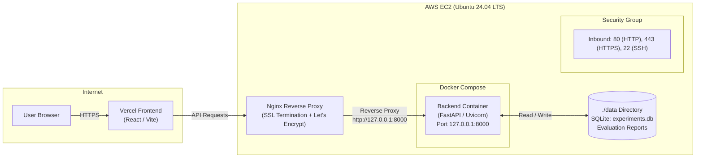

# AWS EC2 Docker Deployment Guide

This guide details the end-to-end production deployment of the **Agentic ML Experimentation System** backend to an Amazon EC2 instance using Docker and Docker Compose, secured behind Nginx with Let's Encrypt SSL, and integrated with a React frontend hosted on Vercel.

---

## Architecture Overview



---

## 1. Launching Ubuntu EC2 and Configuring Security Groups

### Instance Provisioning
1. Open the [AWS EC2 Console](https://console.aws.amazon.com/ec2/).
2. Click **Launch Instance** and configure the following settings:
   - **Name:** `agentic-ml-backend`
   - **AMI:** `Ubuntu Server 24.04 LTS` (or `Ubuntu Server 22.04 LTS`), 64-bit (x86_64).
   - **Instance Type:** `t3.medium` (2 vCPU, 4 GiB RAM) recommended.
     > *Note:* While `t3.small` (2 GiB RAM) can run the service, `t3.medium` is recommended to comfortably handle multi-model scikit-learn training, data profiling, and memory requirements. Avoid `t2.micro` (1 GiB) as it may trigger Out-Of-Memory (OOM) errors during dependency installation or model fitting.
   - **Key Pair:** Select an existing key pair or create a new one (e.g. `agentic-ml-key.pem`).
   - **Storage:** Minimum `20 GiB` gp3 root EBS volume.
   - **Elastic IP (Recommended):** Allocate and associate an Elastic IP with your instance so the public IP remains static across restarts.

### Security Group Inbound Rules
Configure an EC2 Security Group with only the following inbound rules:

| Type | Protocol | Port Range | Source | Description |
| :--- | :--- | :--- | :--- | :--- |
| **SSH** | TCP | `22` | `My IP` (or restricted CIDR) | Remote administration access |
| **HTTP** | TCP | `80` | `0.0.0.0/0` | Let's Encrypt ACME challenge & HTTP to HTTPS redirect |
| **HTTPS** | TCP | `443` | `0.0.0.0/0` | Public encrypted API traffic |

> [!IMPORTANT]
> **Do NOT expose port 8000** in your AWS Security Group. The backend container binds exclusively to the host's loopback interface (`127.0.0.1:8000`), meaning only Nginx running locally on the EC2 instance can reach it.

---

## 2. Installing Docker Engine and Compose on Ubuntu

Connect to your EC2 instance and install Docker using Docker's official APT repository:

```bash
# 1. Update system packages
sudo apt-get update && sudo apt-get upgrade -y

# 2. Install prerequisites
sudo apt-get install -y ca-certificates curl gnupg lsb-release

# 3. Add Docker official GPG key
sudo install -m 0755 -d /etc/apt/keyrings
curl -fsSL https://download.docker.com/linux/ubuntu/gpg | sudo gpg --dearmor -o /etc/apt/keyrings/docker.gpg
sudo chmod a+r /etc/apt/keyrings/docker.gpg

# 4. Set up the Docker repository
echo \
  "deb [arch=$(dpkg --print-architecture) signed-by=/etc/apt/keyrings/docker.gpg] https://download.docker.com/linux/ubuntu \
  $(lsb_release -cs) stable" | sudo tee /etc/apt/sources.list.d/docker.list > /dev/null

# 5. Install Docker Engine and the Docker Compose plugin
sudo apt-get update
sudo apt-get install -y docker-ce docker-ce-cli containerd.io docker-buildx-plugin docker-compose-plugin

# 6. Add ubuntu user to the docker group (avoids needing sudo for docker commands)
sudo usermod -aG docker ubuntu

# 7. Apply group membership (or log out and reconnect)
newgrp docker

# 8. Verify installation
docker --version
docker compose version
```

---

## 3. Connecting to EC2 Through SSH

Ensure your private key file has secure permissions:

```bash
chmod 400 agentic-ml-key.pem
ssh -i agentic-ml-key.pem ubuntu@<YOUR_EC2_PUBLIC_IP_OR_DNS>
```

---

## 4. Cloning the GitHub Repository

Clone the project to the home directory:

```bash
cd ~
git clone https://github.com/sam190905/Agentic-ML-Experimentation-System.git
cd Agentic-ML-Experimentation-System
```

---

## 5. Creating the Server-Side Environment File

Copy the template and configure your production secrets:

```bash
cp .env.example .env
chmod 600 .env
nano .env
```

Set the environment variables appropriately:

```ini
# ── LLM Provider ──────────────────────────────────────
# Set to "gemini" for production experimentation with Gemini API
# Set to "fallback" for deterministic zero-quota demo mode
LLM_PROVIDER=gemini

# ── Gemini Configuration ──────────────────────────────
# Required when LLM_PROVIDER=gemini
GEMINI_API_KEY=AIzaSy...your-production-gemini-key
LLM_MODEL=gemini-3.8-flash

# ── CORS Allowed Origins ─────────────────────────────
# Comma-separated list of allowed frontend origins (e.g., your Vercel domain)
CORS_ORIGINS=https://agentic-ml.vercel.app,https://your-custom-domain.com
```

> [!CAUTION]
> Never commit `.env` into version control. Ensure `.env` is listed in `.gitignore` and `.dockerignore`.

---

## 6. Preparing Writable Persistent Storage

The backend stores its SQLite database (`experiments.db`) and evaluation outputs in `/app/data`, which is mounted from the host `./data` directory.

The container runs as non-root user `appuser` with **UID 1000** and **GID 1000**. On Ubuntu EC2, the default user `ubuntu` is also UID 1000 and GID 1000, which aligns file permissions:

```bash
# Create host data directory if it does not already exist
mkdir -p data

# Ensure ownership belongs to UID 1000:GID 1000 (ubuntu:ubuntu)
sudo chown -R ubuntu:ubuntu data
chmod -R 775 data
```

---

## 7. Building and Starting the Container

Launch the container in detached mode using Docker Compose:

```bash
docker compose up -d --build
```

Verify that the container is running:

```bash
docker compose ps
```

The output should show `agentic-ml-backend` with status `Up (healthy)`.

---

## 8. Verifying `/api/health` and Examining Logs

### Health Check Verification
Query the local endpoint from the EC2 terminal:

```bash
curl -i http://127.0.0.1:8000/api/health
```

Expected response:
```http
HTTP/1.1 200 OK
content-type: application/json
content-length: 17

{"status":"ok"}
```

### Inspect Container Logs
To follow live logs:

```bash
docker compose logs -f backend
```

To view the last 100 log lines:

```bash
docker compose logs --tail=100 backend
```

---

## 9. Configuring Nginx and HTTPS

### 9.1 Install Nginx
```bash
sudo apt-get install -y nginx
sudo systemctl enable nginx
sudo systemctl start nginx
```

### 9.2 Configure Nginx Reverse Proxy
Create a new server block configuration:

```bash
sudo nano /etc/nginx/sites-available/agentic-ml
```

Paste the following configuration (replace `api.yourdomain.com` with your domain or EC2 public DNS):

```nginx
server {
    listen 80;
    server_name api.yourdomain.com;

    # Allow dataset CSV file uploads up to 25MB
    client_max_body_size 25M;

    location / {
        proxy_pass http://127.0.0.1:8000;
        proxy_http_version 1.1;

        # Standard proxy headers
        proxy_set_header Host $host;
        proxy_set_header X-Real-IP $remote_addr;
        proxy_set_header X-Forwarded-For $proxy_add_x_forwarded_for;
        proxy_set_header X-Forwarded-Proto $scheme;

        # Keep timeouts generous for long-running ML experimentation cycles
        proxy_connect_timeout 60s;
        proxy_send_timeout 180s;
        proxy_read_timeout 180s;
    }
}
```

Enable the configuration and reload Nginx:

```bash
sudo ln -sf /etc/nginx/sites-available/agentic-ml /etc/nginx/sites-enabled/
sudo rm -f /etc/nginx/sites-enabled/default
sudo nginx -t
sudo systemctl reload nginx
```

### 9.3 Configure DNS
In your DNS provider (Route 53, Cloudflare, Namecheap, etc.), create an **A Record**:
- **Name:** `api.yourdomain.com`
- **Value:** `<YOUR_EC2_ELASTIC_IP>`

### 9.4 Obtain SSL Certificate with Certbot
Install Certbot and obtain a free Let's Encrypt certificate:

```bash
sudo apt-get install -y certbot python3-certbot-nginx
sudo certbot --nginx -d api.yourdomain.com
```

Certbot will automatically configure HTTPS redirection and set up auto-renewal via systemd timers. You can verify renewal with:

```bash
sudo certbot renew --dry-run
```

---

## 10. Configuring the Vercel Frontend and FastAPI CORS

### 10.1 Vercel Frontend Configuration
1. Open your project on the [Vercel Dashboard](https://vercel.com/).
2. Navigate to **Settings** > **Environment Variables**.
3. Add the API URL variable pointing to your EC2 domain:
   - **Key:** `VITE_API_BASE_URL`
   - **Value:** `https://api.yourdomain.com`
4. Redeploy the frontend project on Vercel to apply the new environment variable.

### 10.2 Backend CORS Configuration
On your EC2 instance, ensure `CORS_ORIGINS` in `.env` includes your deployed Vercel domain:

```ini
CORS_ORIGINS=https://your-frontend-project.vercel.app,https://your-custom-frontend-domain.com
```

Restart the backend container to apply the updated origins:

```bash
docker compose up -d
```

---

## 11. Updating Deployments and Database Backups

### Updating Application Code
When deploying new changes from GitHub:

```bash
cd ~/Agentic-ML-Experimentation-System

# Pull latest code
git pull origin main

# Rebuild and restart the container with minimal downtime
docker compose up -d --build

# Verify container health
docker compose ps
curl -i http://127.0.0.1:8000/api/health
```

### Backing Up the SQLite Database
Because SQLite can have active transactions, use SQLite's online `.backup` command to produce safe snapshots without stopping the container:

```bash
# Create backups directory
mkdir -p ~/backups

# Create a consistent hot backup of the SQLite database
sqlite3 ~/Agentic-ML-Experimentation-System/data/experiments.db \
  ".backup '$HOME/backups/experiments_$(date +%Y%m%d_%H%M%S).db'"
```

#### Automated S3 Backup Script (Optional)
If you have configured the AWS CLI with an S3 bucket:

```bash
#!/usr/bin/env bash
BACKUP_FILE="$HOME/backups/experiments_$(date +%Y%m%d_%H%M%S).db"
sqlite3 ~/Agentic-ML-Experimentation-System/data/experiments.db ".backup '$BACKUP_FILE'"
aws s3 cp "$BACKUP_FILE" s3://your-backup-bucket/sqlite/
find ~/backups -type f -name "*.db" -mtime +7 -delete
```

This can be scheduled daily via `crontab -e`:
```cron
0 2 * * * /bin/bash /home/ubuntu/backup_db.sh > /dev/null 2>&1
```

---

## Deployment Checklist Summary

- [ ] EC2 instance running Ubuntu 24.04/22.04 LTS (`t3.medium`).
- [ ] Security Group open only on ports 22, 80, 443 (port 8000 closed to public).
- [ ] Docker Engine and Compose Plugin installed.
- [ ] Repository cloned to `~/Agentic-ML-Experimentation-System`.
- [ ] `.env` configured with production `GEMINI_API_KEY`, `LLM_PROVIDER`, and `CORS_ORIGINS`.
- [ ] `data/` directory created with `ubuntu:ubuntu` ownership.
- [ ] Docker Compose running with `agentic-ml-backend` in `(healthy)` status.
- [ ] Nginx configured as reverse proxy with `client_max_body_size 25M`.
- [ ] Let's Encrypt SSL certificate installed via Certbot.
- [ ] Vercel frontend environment variable `VITE_API_BASE_URL` set and deployed.
- [ ] End-to-end experiment run tested from Vercel UI.
